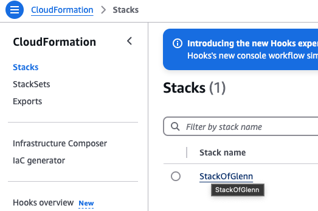
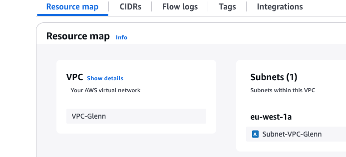
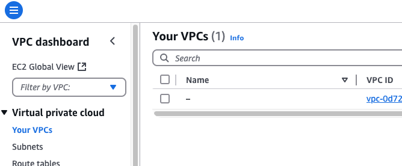
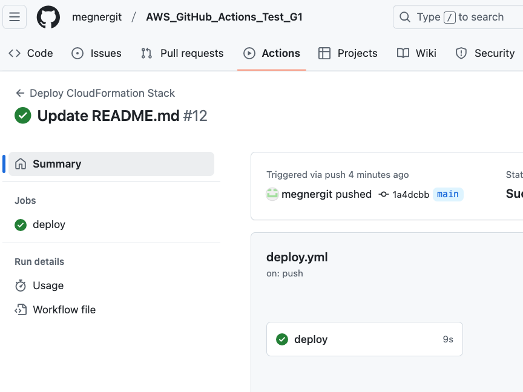
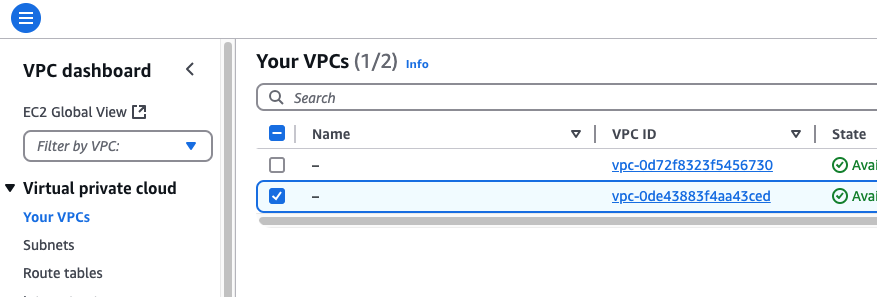
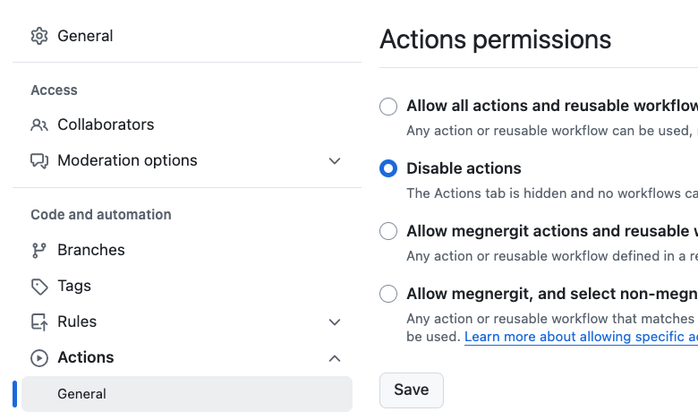

# GitHub Actions with CloudFormation

## Motivation

Test CloudFormation with GitHub Actions.
The goal is to deploy

- VPC
- subnet

in AWS (because it is free!).


## Overview

1. Create an IAM user for management.
2. Edit CloudFormation template file.
3. Test if CloudFormation works from aws cli.
4. Create an IAM user for the deployment.
5. Edit GitHub Action deployment file

<!-- ------------------------------  -->

## Procedure

### Create an IAM user for management

It is highly recommended not to use root user for testing.
Do the following:

- Create AWS Organization and invite your account. It does not cost. 
- Create an admin group at IAM Identity Center
- Create a user at IAm Identity Center and add it to teh admin group
- Attach AdministratorRole to the group

To ease the experiment

- Download Google Authenticator to use for MFA (=multi- factor authentication)
- Set up single sign on.

Log in using single sign on.
```
aws configure sso
```

Check if it works.
```
aws s3 ls --profile XXXX
```

Set an environment variable.
```
export AWS_PROFILE=XXXX
```

Check if it works (without "--profile XXXX")
```
aws s3 ls
```

For the security remove AWS Access Key and AWS Secret Access Key from
root account


### Prepare CloudFormation template file

We will deploy VPC and Subnet.

```
WSTemplateFormatVersion: "2010-09-09"
Description:
  "Create a network to test CloudFormation and GitHub Actions"

  #--------------------------------------
Parameters:
  VPCName:
    Default: VPC-Glenn
    Type: String
  SubnetName:
    Default: Subnet-VPC-Glenn
    Type: String

Resources:
  #--------------------------------------
  # VPC
  #--------------------------------------
  GlennVPC:
    Type: "AWS::EC2::VPC"
    Properties:
      CidrBlock: 10.1.0.0/16
      Tags:
        - Key: Name
          Value: !Ref VPCName
  #--------------------------------------
  # Subnet
  #--------------------------------------
  GlennSubnet01:
    Type: "AWS::EC2::Subnet"
    Properties:
      VpcId:
        Ref: GlennVPC
      AvailabilityZone: eu-west-1a
      CidrBlock: 10.1.1.0/24
      Tags:
        - Key: Name
          Value: !Ref SubnetName
#--------------------------------------
# Outputs
#--------------------------------------
Outputs:
  VPCId:
    Value: !Ref GlennVPC
    Description: "The Vpc Id Created By This Stack."
  SubnetId:
    Value: !Ref GlennSubnet01
    Description: "The Subnet Id Created By This Stack."
#--------------------------------------
```

### Test CloudFormation template with aws cli

First we will test if the template file we wrote above
works from terminal.

Check if the syntax is correct.

```
aws cloudformation validate-template --template-body file://vpc-1.yml
{
    "Parameters": [
        {
            "ParameterKey": "SubnetName",
            "DefaultValue": "Subnet-VPC-Glenn",
            "NoEcho": false
        },
        {
            "ParameterKey": "VPCName",
            "DefaultValue": "VPC-Glenn",
            "NoEcho": false
        }
    ],
    "Description": "Create a network to test CloudFormation and GitHub Actions"
}

```
Looks all right.

Then create a stack
```
aws cloudformation create-stack --stack-name StackOfGlenn \
    --template-body file://vpc-1.yml
```

Check if it is there.

```
aws cloudformation describe-stacks
```

Check if it is there on AWS Management Console.



Check if VPC and Subnet are there.



All right.

Delete stack.
```
aws cloudformation delete-stack --stack-name StackOfGlenn
```
Check if the vpc is gone.



All right.


### Create an IAM user for GitHub Actions

Create an IAM user, let us say, ```github-actions-deployer``` on AWS IAM.
This time we do not need to use Identity Center, as it is not a human user.

Give this much of permissions.

```
		{
			"Effect": "Allow",
			"Action": [
				"logs:CreateLogGroup",
				"logs:CreateLogStream",
				"logs:PutLogEvents"
			],
			"Resource": "*"
		},
		{
			"Effect": "Allow",
			"Action": [
				"cloudformation:CreateStack",
				"cloudformation:UpdateStack",
				"cloudformation:DeleteStack",
				"cloudformation:DescribeStacks",
				"cloudformation:GetTemplate",
				"cloudformation:GetTemplateSummary",
				"cloudformation:CreateChangeSet",
				"cloudformation:ExecuteChangeSet",
				"cloudformation:ListChangeSets"
			],
			"Resource": "*"
		},
		{
			"Effect": "Allow",
			"Action": [
				"ec2:CreateVpc",
				"ec2:DescribeVpcs",
				"ec2:DeleteVpc",
				"ec2:CreateSubnet",
				"ec2:DescribeSubnets",
				"ec2:DeleteSubnet",
				"ec2:DescribeRouteTables",
				"ec2:AssociateRouteTable",
				"ec2:ModifyVpcAttribute"
			],
			"Resource": "*"
		}
```		

### Prepare GitHub Actions workflow file. 

Create ```./.github/workflows/deploy.yml```.

Set up GitHub secrets here.


Then commit the files. Check if GitHub Actions started and completed.



All right.

Check if the resouces are created.



All right. Remove all resources.

```
aws cloudformation delete-stack --stack-name StackOfGlenn
```

Make sure to ***Disable** GitHub Actions.



Otherwise, when you update README.md in the future, you will create resources by accdent.

Push README.md once again and make sure no resource will be created. 


<!-- ------------------------------  -->

# END

<!-- ####################  -->
